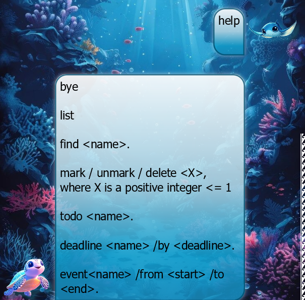

# Botling User Guide


Botling is a task management chatbot that helps you track your todos, deadlines, and events via simple yet effective text commands.
All your tasks are automatically saved, and even sorted according to priority.

## **Table of Contents**
1. [Quick Start](#quick-start)
1. [Features](#features)  
   1. [Help](#help-command)  
   1. [Bye](#bye-command)  
   1. [List](#list-command)
   1. [Find](#find-command)
   1. [Mark / Unmark / Delete](#mark-unmark-delete-commands)  
   1. [To-Dos](#to-do-command)  
   1. [Deadlines](#deadline-command)
   1. [Events](#event-command)
   1. [Date Specifications](#date-specification)
   1. [Sorting](#sorting-tasks)
   1. [Data Storage](#data-storage)
1. [Known Issues](#known-issues)
1. [Image Sources](#image-sources)

## Quick Start

1. Ensure you have `Java 17` or above installed in your computer.  

1. Download the latest [`.jar` file here](https://github.com/ChinZJ/ip/releases).  
1. Copy the file into your desired folder, and double-click on the file to run the application.  

1. Alternatively, run `java -jar Botling.jar` in your console to run the application. You should see a similar interface appear as shown above.

1. Easily get started with Botling by typing `help` into the chat!  
  All commands and their arguments will be shown.

1. To get started, it is as easy as this: `todo chores`.
  Botling will immediately add your task to its list!

1. For more details, refer to [Features](#features).

## Features
  
<div markdown="block" class="alert alert-info">

**:information_source: Notes about the command format:**<br>

* Words demarcated with `<>` are parameters to be supplied by the user.

* Words following `/` (e.g. `/by` in `deadline`) are commands. If the user input contains multiple commands (e.g. `deadline assignment 1 /by today /by tomorrow /by the day after`, the first command (in this case `/by`) will be greedily chosen.   
 The remaining input: `today /by tomorrow /by the day after` will be used as the parameter.  
  ```
  // Demonstration of parameter seperation.
  Task name: assignment 1
  Deadline today /by tomorrow /by the day after
  ```

* Parameters must be provided in sequential order.  

* Extraneous parameters for commands that do not take in parameters (such as `help`, `list`, `exit` and `clear`) will be **not** be ignored.  
  Instead they will be unrecognized.
</div>

### Help Command

`help`    
Provides a quick reminder of all the commands implemented.


### Bye Command

`bye`    
Closes the application.  
  
### List Command

`list`  
Lists all current tasks that is recorded by Botling.  
  
### Find Command

`find <name>`  
Lists all recorded tasks that contains `<name>` within its task name.  
This method is **case-insensitive**.  

### Mark / Unmark / Delete Commands <a name="mark-unmark-delete-commands"></a>

`mark <X>`, `unmark <X>`, `delete <X>`    
These commands follow the same format, where only the index of the task needs to be specified.  
Note that the application uses `1 based indexing`, as provided by the `list` and the `find` commands.  

### To-do Command

`todo <name>`    
A basic task labelled `<name>`, representing a to-do with no urgency.  
  
###  Deadline Command

`deadline <name> /by <deadline>`  
A deadline task labelled `<name>`, with the deadline at `<deadline>`.  
For information on the date specification of `<deadline>`, refer to [Date Specification](#date-specification).  
  
### Event Command

`event <name> /from <start> /to <end>`  
An event labelled `<name>`, that starts from `<start>` till `<end>`.  
For information on the date specification of `<start>` and `<end>`, refer to [Date Specification](#date-specification).  
  
### Date Specification
  
Although `deadline` and `event` commands can take in date time formats, it is **not compulsory**.  
Currently, the following date time formats are supported:
* `yy(yy)-MM-dd` (e.g. 25-02-21)
* `dd/MM/yy(yy)` (e.g. 21/02/25)
* `dd MMM yy(yy)` (e.g. 21 Feb 25)

Notes:
* The `()` is optional (i.e. you may use the last two digits of the year)  
* `dd` and `MM` refers to numerical digits, whereas `MMM` refers to the short form name of the month (e.g. `Jan`, `Feb`, etc.). 
* The `HHmm` (24-hour time format) is completely optional, and Botling will assume it to be `0000` by default.
* Dates in the past are actually accepted.  
  However the `event` `start` date **must be before** the `end` date.
  
### Sorting Tasks
  
By default, Botling comes with a basic sorting function to help you prioritize your tasks! The rules are as follows:
* For tasks with provided dates (according to [date specifications](#date-specification):
  * Those with the earliest end dates (the `<deadline>` for `deadline` tasks and the `<end>` for `event` tasks) will be prioritized first.  
  * `event` tasks that do not have an `end` date will then use either their time of creation (when user enters the task) of their `<start>` date as a proxy.
  * `event` tasks with the same `<end>` date will then be sorted by their `<start>` date.
* Then, tasks will be sorted according to their date of creation.
* Any remaining conflicts will be resolved via lexicographical ordering of their `<name>`.
  
### Data Storage
  
The data is located under [`./data/history.txt`]("../data").  
This file can be ported between different applications to be used by Botling.
 
## Known Issues
  
  
Due to the fact that `JavaFX` `WebView` objects are not recommended for this project due to its large size, making selectable and colorable text within the chatbot requires an overlay of a `TextArea` object onto a `TextFlow` object. Due to the fact that their proportions are innately different, the margins have to be hardcoded. Botling is optimized for `1920x1080` at `125%` screen scale. Resolutions and scales differing from this are likely to cause the selected text to be misaligned from the displayed text. Thus, it is recommended that the user uses the `select all` option (as shown in the demo) to copy the text if required. This specific part of the project was with the help of the following sources:  
* https://stackoverflow.com/questions/79395124/javafx-overlaying-textflow-with-textarea?noredirect=1#comment140023326_79395124  

(P.S. If you have a more elegant solution, please feel free to contact me. Thank you!)

### Image Sources
Images were obtained from the following links:
* [Manta ray image](https://stock.adobe.com/search?k=manta+cartoon&asset_id=1024077717)
* [Turtle image](https://www.freepik.com/premium-ai-image/cute-cartoon-sea-turtle-swimming-underwater-colorful-coral-reefs_344370416.htm)
* [Kakau](https://www.shutterstock.com/image-vector/seamless-kakau-hawaiian-wave-pattern-tattoo-152529788)
* [Underwater ocean wallpaper](https://www.freepik.com/premium-ai-image/illustration-with-deep-underwater-ocean-scene_347862215.htm)
